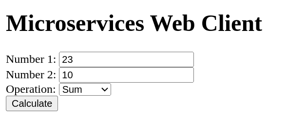
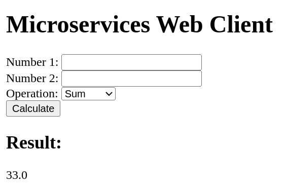

# Ejemplo simple de microservicios

Start docker:
<code>
systemctl start docker
</code>

Run the example in the terminal type:
<code>
docker-compose up
</code>

Go to the browser
<code>
http://localhost:8080/web
</code>

